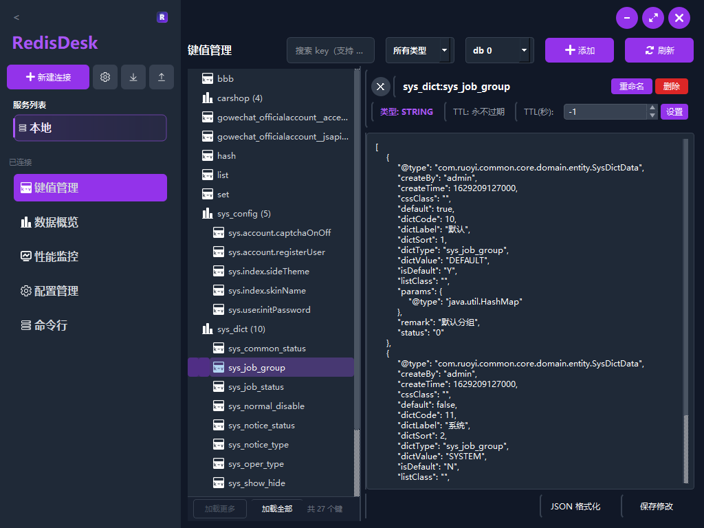
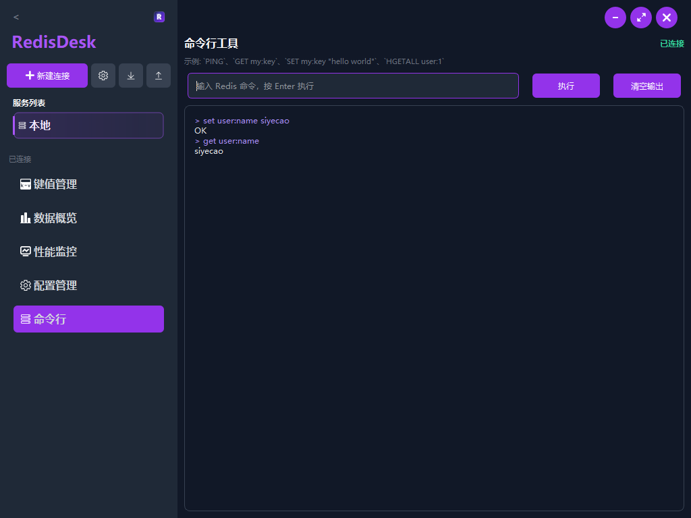
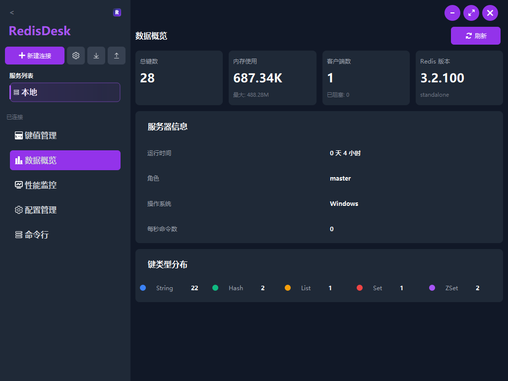
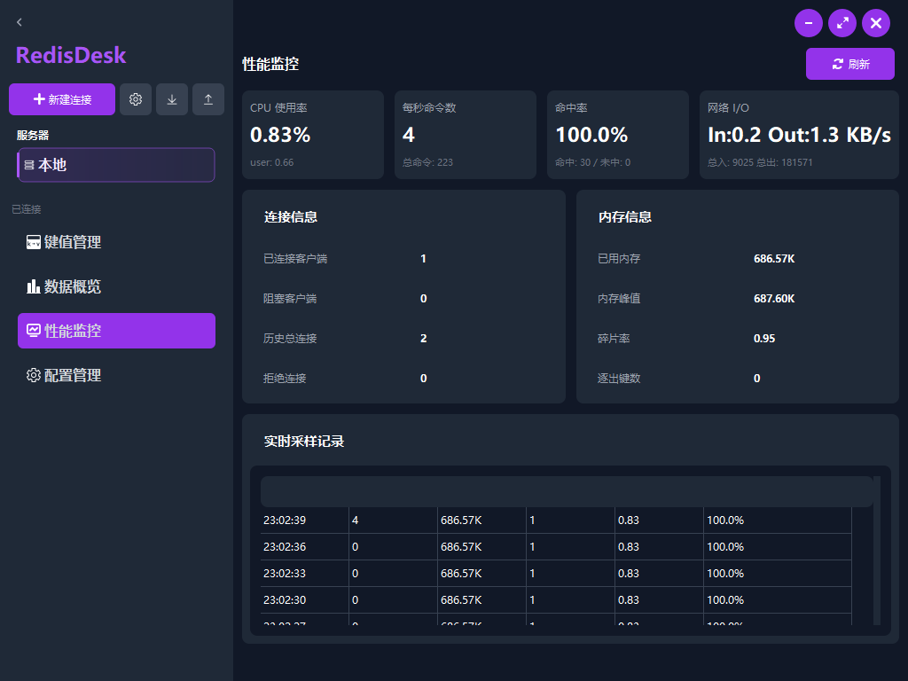
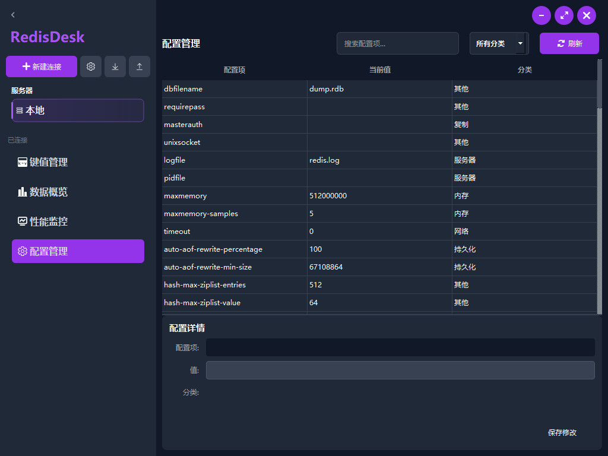

# RedisDesk

[English](README.en.md)

RedisDesk 是一个基于 Qt Widgets 的桌面端 Redis 管理工具，面向日常开发、调试和运维场景，提供连接管理、键值浏览、数据编辑、数据概览、性能监控、配置管理和内置命令行等能力。

## Release 下载

- GitHub Release: https://github.com/lengyue1084/redis-desk/releases/tag/v0.2.2
- Gitee Release: https://gitee.com/xiaopangda/redis-desk/releases/tag/v0.2.2

## 功能特性

- 连接管理：支持新建、编辑、删除、测试、导入和导出 Redis 连接配置
- 自动连接：启动后可自动连接首个已保存连接
- 键值管理：基于 `SCAN` 增量加载 Key，支持分页、加载全部、通配搜索和类型筛选
- 命名空间展示：按 `:` 层级树形展示 Key
- 数据编辑：支持查看和编辑 `string`、`hash`、`list`、`set`、`zset`
- Key 操作：支持新建 Key、删除 Key、修改 TTL、切换 `db 0` 到 `db 15`
- 数据概览：展示 Key 总数、内存使用、客户端连接数、Redis 版本、运行时长、实例角色和 Key 类型分布
- 性能监控：展示 CPU、命令处理速率、命中率、网络 I/O、内存指标和最近采样记录
- 配置管理：支持基于 `CONFIG GET *` 查询配置，并通过 `CONFIG SET` 修改配置值
- 内置 CLI：可从当前连接的右键菜单直接打开 Redis 命令行

## 界面预览

### 键值管理



### CLI



### 数据概览



### 性能监控



### 配置管理



## 技术栈

- C++17
- Qt Widgets
- Qt Network
- CMake 3.16+
- Qt 5 / Qt 6

## 构建说明

### 环境要求

- CMake 3.16 或更高版本
- 安装包含 `Widgets` 和 `Network` 模块的 Qt
- 支持 C++17 的编译器

### 配置

如果本地已通过环境变量 `QTDIR` 指向 Qt 安装目录，可直接使用预设：

```bash
cmake --preset Qt-Release -S .
```

也可以手动指定 Qt 路径：

```bash
cmake -S . -B build -DCMAKE_PREFIX_PATH=/path/to/Qt -DCMAKE_BUILD_TYPE=Release
```

### 编译

```bash
cmake --build out/build/release --config Release
```

## 目录结构

```text
.
|-- docs/
|   `-- images/
|-- src/
|   |-- constants/
|   |-- delegates/
|   |-- dialogs/
|   |-- models/
|   |-- redis/
|   |-- resources/
|   |-- utils/
|   `-- widgets/
|-- CMakeLists.txt
|-- CMakePresets.json
`-- README.en.md
```

## 当前限制

- 当前 Redis 通信层是项目内置的轻量 RESP 实现，并非完整第三方 SDK
- 当前认证支持密码形式的 `AUTH`，也支持 ACL 用户名加密码认证
- 当前主要覆盖常见基础数据类型，不包含 `stream`
- 当前监控页面基于 `INFO` 轮询，不是 Redis `MONITOR` 命令的流式监听

## License

本项目基于 MIT License 发布，详情见 [LICENSE](LICENSE)。
